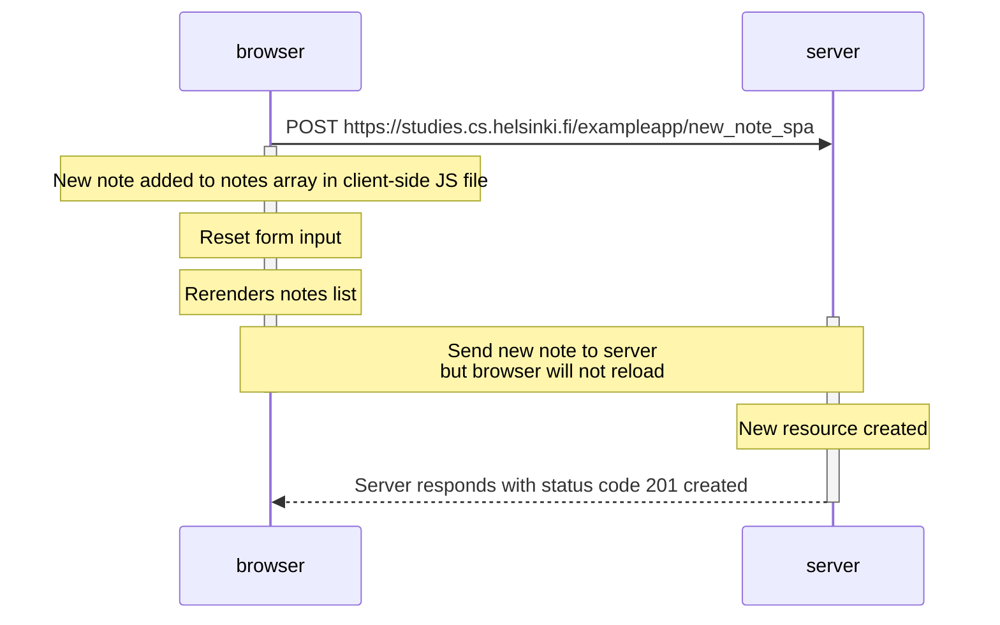

```mermaid
sequenceDiagram
    participant browser
    participant server

    browser->>server: POST https://studies.cs.helsinki.fi/exampleapp/new_note_spa
    activate browser
    Note  over browser:  New note added to notes array in client-side JS file
    Note  over browser:  Reset form input
    Note  over browser:  Rerenders notes list

    activate server
    Note  over browser, server:  Send new note to server <br>but browser will not reload
    deactivate browser

    Note over server: New resource created
    server-->>browser: Server responds with status code 201 created
    deactivate server

```
